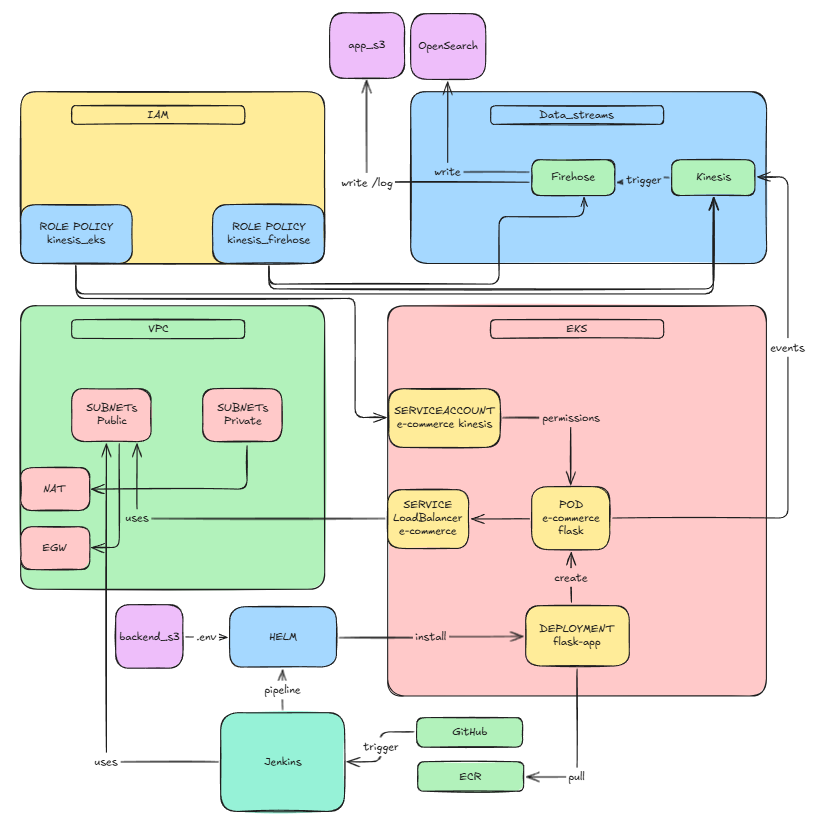
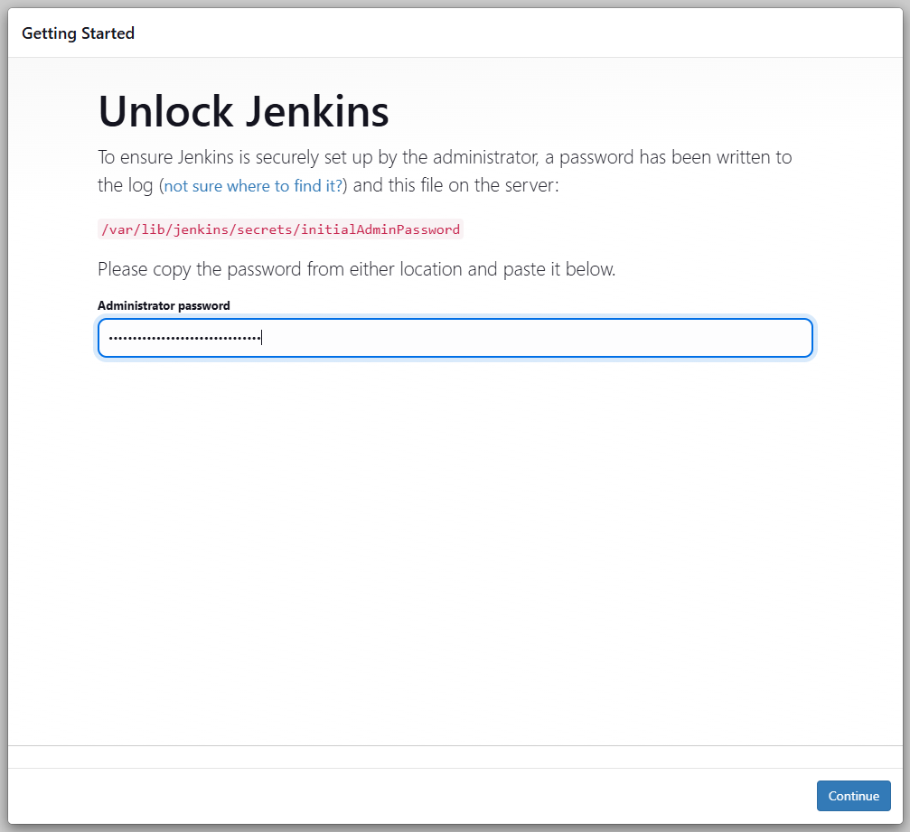
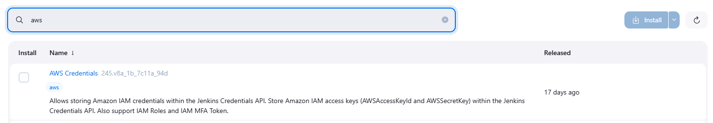
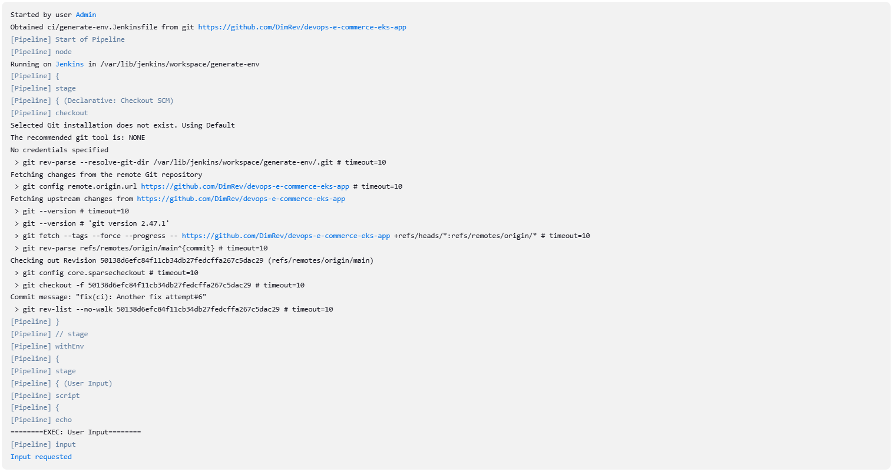
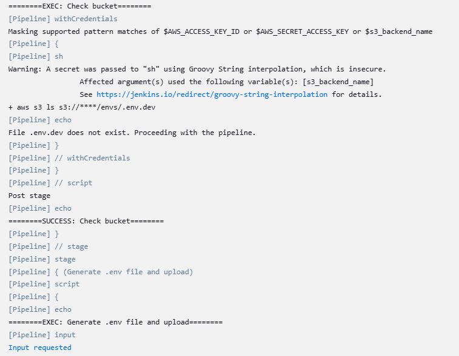
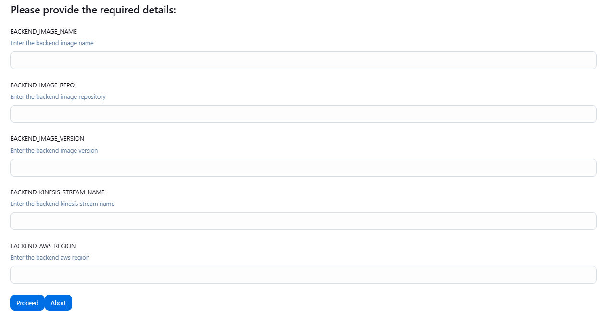
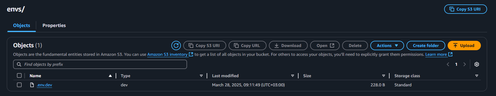

# DevOps e-Commerce Scalable Web App

## Introduction



## Setup

1. Apply the terraform infra

```bash
make tf-apply
```

2. Get the Jenkins IP from the outputs

```bash
app_bucket_name = ""
eks_cluster_endpoint = ""
eks_cluster_name = ""
eks_cluster_oidc_issuer_url = ""
firehose_delivery_stream_arn = ""
jenkins_ip = "<jenkins-ip>"
kinesis_stream_arn = ""
vpc_id = ""
```

3. Connect to Jenkins using the Jenkins IP on port 8080, `http://<jenkins-ip>:8080`

4. Init the Jenkins with admin credentials



5. Install the AWS Credentials Plugin



6. Create IAM & Jenkins Credentials, When creating the credentials in jenkins **IMPORTANT** make the id of the credentials as `aws_credentials`, add the `s3_backend_name` as the text secret with the name of the backend bucket.

7. Create a pipeline and connect it to the repo, target the CI in `ci/generate-env.Jenkinsfile`:


Run the pipeline


Provide ENV and APP_NAME


Continue to run the app, checking if the env already exist in the bucket


Provide the other required env details


Env is generated in the bucket
