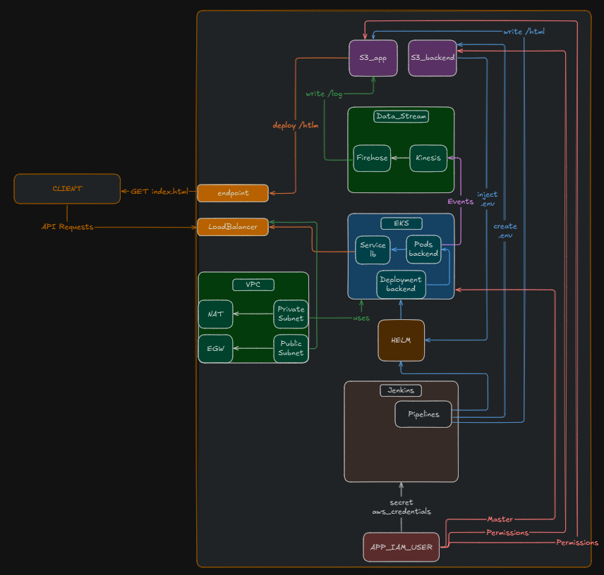
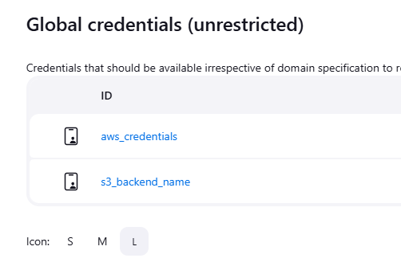

# DevOps e-Commerce Scalable Web App

## Introduction



This repository showcases a scalable architecture for a web application, specifically demonstrating an e-commerce platform concept, deployed on AWS using modern DevOps practices. It serves as a practical example of integrating various cloud services and automation tools to build, deploy, and manage a containerized application.

**Key Technologies & Concepts Demonstrated:**

- **Infrastructure as Code (IaC):** Terraform is used to provision and manage the core AWS infrastructure (VPC, EKS Cluster, S3 Buckets, IAM Roles, etc.) reliably and repeatably.
- **Container Orchestration:** Amazon EKS (Elastic Kubernetes Service) hosts the backend Flask application, providing scalability, resilience, and efficient resource utilization.
- **CI/CD:** Jenkins automates the build, configuration, and deployment processes. Pipelines handle environment setup and Helm chart deployments to EKS.
- **Helm:** Used for packaging and managing the deployment of the backend application onto the Kubernetes cluster.
- **Cloud Services:** Leverages AWS S3 for frontend hosting and backend configuration/state, Load Balancers for traffic distribution, Kinesis/Firehose for potential data streaming, and IAM for secure access control.
- **Separation of Concerns:** Clear distinction between the frontend (React/Vite app on S3) and the backend (Flask API on EKS).

The goal is to provide a reference architecture demonstrating how these components work together in a cloud-native environment.

## Prerequisites

- AWS IAM User (with sufficient permissions to create VPC, EKS, S3, IAM roles, etc.)
- AWS CLI configured
- An existing S3 Bucket to store Terraform state (referred to as "S3 Backend bucket" below). _Note: This is for Terraform state, distinct from the S3 buckets created by Terraform for the app/backend._
- `pnpm` version 10 (or compatible Node.js environment to install it)
- `make` utility

## Project Structure

```
.
├── .vscode/ # VSCode settings (optional)
├── app/
│ ├── backend-app/ # Flask backend source code
│ ├── frontend-app/ # React/Vite frontend source code
│ └── Dockerfile # Dockerfile for the backend application
├── assets/ # Images for README
├── ci/ # Jenkinsfiles for CI/CD pipelines
├── docs/ # Project documentation (optional)
├── k8s/
│ └── backend-helm/ # Helm chart for the backend application
├── scripts/ # Utility and deployment scripts (e.g., frontend deploy)
├── terraform/ # Terraform code for infrastructure provisioning
├── .env # Local environment variables (gitignored)
├── .env.example # Example environment variables
├── .gitignore # Git ignore file
├── Makefile # Make commands for common tasks
└── README.md # This file
```

## Setup

0.  **Configure AWS CLI Profile:** Define the AWS CLI profile for the IAM User created in Prerequisites. **IMPORTANT:** This _same user/profile_ needs to be configured within Jenkins later for the pipelines to interact with AWS.

    ```bash
    # Replace 'e-commerce' if you prefer a different profile name
    aws configure --profile e-commerce
    ```

    This profile (`e-commerce` in this example) will be used by Terraform locally and expected by Jenkins pipelines. Terraform will grant this user necessary EKS permissions upon cluster creation.

1.  **Provision Infrastructure:** Apply the Terraform configuration. You will need to provide the name of your pre-existing S3 bucket for Terraform state when prompted, or configure it directly in `terraform/backend.tf`. Ensure you specify the correct AWS profile if it's not your default.

    ```bash
    # If 'e-commerce' is not your default profile:
    # export AWS_PROFILE=e-commerce

    # Navigate to the terraform directory
    cd terraform

    # Initialize Terraform (only needed the first time)
    # You'll be prompted for the S3 bucket name for the backend state
    terraform init

    # Apply the infrastructure changes
    terraform apply

    # Alternatively, use the Makefile from the root directory
    # cd ..
    # make tf-apply
    ```

2.  **Get Jenkins IP:** Note the Jenkins instance public IP address from the Terraform outputs.

    ```bash
    # Run from the terraform directory
    terraform output jenkins_ip
    # Example output: jenkins_ip = "<jenkins-ip>"

    # Or use the Makefile from the root directory
    # make tf-outputs
    ```

3.  **Unlock Jenkins:** Open the Jenkins UI in your browser: `http://<jenkins-ip>:8080`. You will be prompted for an initial admin password.
    

4.  **Retrieve Initial Password:** SSH into the Jenkins EC2 instance (using the key pair specified in your Terraform variables or default AWS configuration) and get the password.

    ```bash
    # Replace <jenkins-ip> with the actual IP
    # You might need to specify the key pair: ssh -i /path/to/key.pem ec2-user@<jenkins-ip>
    ssh ec2-user@<jenkins-ip>
    sudo cat /var/lib/jenkins/secrets/initialAdminPassword
    ```

5.  **Complete Jenkins Setup:** Paste the password into the Jenkins UI, create your admin user, and install the suggested default plugins.

6.  **Install AWS Credentials Plugin:** Navigate to `Manage Jenkins` -> `Plugins` -> `Available Plugins` and install the `CloudBees AWS Credentials` plugin.

7.  **Configure Jenkins Global Credentials:**

    - Go to `Manage Jenkins` -> `Credentials` -> `System` -> `Global credentials (unrestricted)`.
    - **Add AWS Credentials:**
      - Click `Add Credentials`.
      - Kind: `AWS Credentials`.
      - ID: `aws_credentials` (This exact ID is referenced in the Jenkinsfiles).
      - Description: (Optional, e.g., "AWS Credentials for E-commerce Project").
      - Enter the `Access Key ID` and `Secret Access Key` of the _same IAM user_ configured in step 0.
      - Click `OK`.
    - **Add S3 Backend Bucket Name:**
      - Click `Add Credentials`.
      - Kind: `Secret text`.
      - ID: `s3_backend_name` (This exact ID is referenced in the Jenkinsfiles).
      - Secret: Enter the name of the S3 bucket created by Terraform to hold the backend's `.env` file (you can get this from `terraform output s3_backend_name`).
      - Description: (Optional, e.g., "S3 Bucket for Backend Env File").
      - Click `OK`.



8.  **Create Environment Setup Pipeline:**

    - In Jenkins, click `New Item`.
    - Enter a name (e.g., `generate-env`).
    - Select `Pipeline`.
    - Click `OK`.
    - In the configuration page, scroll down to the `Pipeline` section.
    - Definition: `Pipeline script from SCM`.
    - SCM: `Git`.
    - Repository URL: Enter the URL of your Git repository.
    - Credentials: Configure if your repository is private.
    - Branch Specifier: Specify the branch (e.g., `*/main`).
    - Script Path: `ci/generate-env.Jenkinsfile`.
    - Save the pipeline.

9.  **Run Environment Setup Pipeline:**

    - Go to the `generate-env` pipeline dashboard.
    - Click `Build with Parameters`.
    - Provide the required details (like database credentials, etc. - these will be stored in the `.env` file).
    - Click `Build`. This pipeline creates the `.env` file and uploads it to the designated backend S3 bucket.

10. **Create Helm Deployment Pipeline:**

    - Follow the same steps as in step 8 to create another pipeline (e.g., `deploy-backend`).
    - Set the Script Path to `ci/backend-helm-install-or-upgrade.Jenkinsfile`.
    - Save the pipeline.

11. **Run Helm Deployment Pipeline:**

    - Go to the `deploy-backend` pipeline dashboard.
    - Click `Build with Parameters`.
    - Provide any required parameters (e.g., image tag if applicable).
    - Click `Build`. This pipeline fetches the `.env` from S3, injects it as a secret, and deploys/upgrades the backend application Helm chart (from `k8s/backend-helm`) in the EKS cluster.

12. **Configure Frontend Environment:**

    - Navigate to the frontend application directory: `cd app/frontend-app`.
    - Create a `.env.production` file by copying `.env.example`.
    - Edit `.env.production` and set `VITE_API_URL` to the HTTP URL of the Load Balancer created by the EKS service. You can find this URL in the AWS console (EC2 -> Load Balancers or EKS -> Cluster -> Workloads -> Service). It will look something like `http://<alb-dns-name>.<region>.elb.amazonaws.com`.

13. **Install Frontend Dependencies:** Ensure you have `pnpm` version 10 installed.

    ```bash
    # If needed, install pnpm v10 globally using npm (requires Node.js >= 18)
    # npm i -g pnpm@10

    # Navigate to the frontend directory if not already there
    cd app/frontend-app

    # Install dependencies
    pnpm install
    ```

14. **Deploy Frontend:** Run the deployment script located in the `scripts/` directory from the _root_ directory of the project. This script builds the frontend and syncs it to the `S3_app` bucket created by Terraform.

    ```bash
    # Make sure you are in the project's root directory
    cd ../..

    # Run the deployment script (adjust script name if different)
    ./scripts/frontend-deploy.sh
    ```

    _(Note: Ensure the script name `frontend-deploy.sh` inside the `scripts/` directory is correct)._

## Accessing the Application

- **Frontend:** Access the web application via the S3 bucket's static website endpoint. You can find this URL in the AWS S3 console by selecting the `S3_app` bucket -> Properties -> Static website hosting. It will be something like `http://<app-bucket-name>.s3-website-<region>.amazonaws.com`.
  _(Note: For production, use the CloudFront URL as described below)._
- **Backend API:** The API is accessible via the Load Balancer's DNS name (found in step 12). Direct access is usually not required by end-users, as the frontend interacts with it.

## Production Enhancements

To move this demo towards a production-ready setup, consider the following changes:

### Frontend (S3 via CloudFront)

1.  **Create CloudFront Distribution:** Set up an AWS CloudFront distribution.
2.  **Configure S3 Origin:** Point the CloudFront distribution's origin to the `S3_app` bucket (use the bucket name, _not_ the static website endpoint).
3.  **Restrict S3 Bucket Access:** Remove public access from the S3 bucket. Use CloudFront Origin Access Identity (OAI) or Origin Access Control (OAC) to allow CloudFront to securely read from the bucket. Update the bucket policy accordingly.
4.  **Enable HTTPS:** Attach an AWS Certificate Manager (ACM) SSL/TLS certificate (in the `us-east-1` region for CloudFront) to the CloudFront distribution for your custom domain.
5.  **Set Root Object:** Configure the CloudFront distribution's default root object to `index.html`.
6.  **Error Pages:** Configure custom error responses (e.g., redirect 404s to `index.html` for single-page applications).

### Backend (EKS Load Balancer with HTTPS)

1.  **Provision Certificate:** Create or import an SSL/TLS certificate for your backend's custom domain using AWS Certificate Manager (ACM) in the _same region_ as your EKS cluster and Load Balancer.
2.  **Configure Load Balancer Listener:** Modify the AWS Load Balancer (likely an ALB created by the AWS Load Balancer Controller via the Kubernetes Service definition) serving the EKS service:
    - Add an HTTPS listener on port 443.
    - Associate the ACM certificate with this listener.
    - Configure the listener to forward traffic to the target group pointing to your EKS pods (likely on HTTP, as TLS terminates at the LB). This might involve updating annotations on your Kubernetes Service resource if using the AWS Load Balancer Controller.
3.  **Update Frontend Configuration:** Ensure the frontend application's `VITE_API_URL` in `.env.production` points to the new HTTPS endpoint (`https://your-api-domain.com`). Redeploy the frontend after this change.

### DNS

- Update your DNS records (e.g., using Route 53) to point your custom domain(s) to the CloudFront distribution CNAME (for the frontend) and the Load Balancer CNAME (for the backend API).

## Cleanup

To avoid ongoing AWS charges, destroy the infrastructure created by Terraform when you are finished.

```bash
# Ensure you are in the terraform directory
cd terraform

# If using a specific profile: export AWS_PROFILE=e-commerce
terraform destroy
```

**Important**: This will delete the EKS cluster, EC2 instances (Jenkins), Load Balancers, S3 buckets created by Terraform (including the one holding the .env file), and other associated resources. It will not delete the S3 bucket used for Terraform state storage or the IAM user you created manually. Manually delete those if required.
